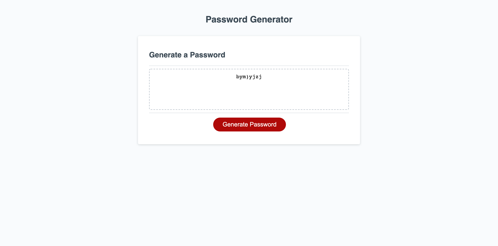

# This is a password generator
## Table of contents
- [General Info](#general-info)
- [Technologies](#technologies)
- [Next_Steps] (#Next Steps)
- [Author](#author)
## General Info
This is a simple password generator which meets the following conditions:
* Functional, deployed application
* GitHub repository with README describing the project
* Button click to generate password.
* Character type selection which includes: lowercase and uppercase letters, numeric, and special characters.
* Able to choose between 8 - 128 characters for password.
* Random password generated in page.
## Main Page

## Technologies
This project is created with:
- [HTML](https://html.com/)
- [CSS](https://www.w3.org/Style/CSS/Overview.en.html)
- [Javascript](https://www.javascript.com/)
## Next Steps
- Build recursive function which restarts the generate function should the user not choose any characters. 
- Restart the passCharLength function on line 32 if user chooses anything other then numbers for the password length.
## Author
- Shawn Flanigan
